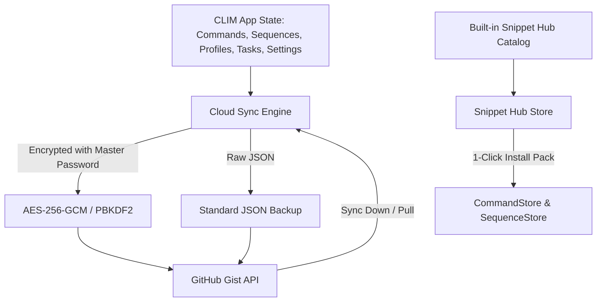

# Kế Hoạch Triển Khai: Giai Đoạn 4 - Đồng Bộ Đám Mây & Kho Lệnh Mẫu Cộng Đồng (Cloud Sync & Snippet Hub)

> **Mục tiêu**: Cung cấp giải pháp sao lưu và đồng bộ 2 chiều toàn bộ cấu hình CLIM qua GitHub Gist với mã hóa đầu cuối AES-256-GCM, đồng thời tích hợp Thư viện Kho Lệnh Mẫu (Snippet Hub) 1-Click phong phú cho lập trình viên và quản trị viên hệ thống.

---

## 1. Kiến Trúc & Thiết Kế Kỹ Thuật

### A. Backend: GitHub Gist Sync & End-to-End Encryption (`src/main/cloud-sync.ts`)
- **API GitHub Gist**:
  - Sử dụng Native HTTPS request của Node.js (`https.request`) để giao tiếp với `https://api.github.com/gists`.
  - Hỗ trợ tạo mới Gist riêng tư (`public: false`), cập nhật Gist hiện có (`PATCH /gists/:id`), lấy dữ liệu Gist (`GET /gists/:id`).
- **Mã Hóa Đầu Cuối (AES-256-GCM + PBKDF2)**:
  - Hàm `encryptBackup(data: object, password?: string)`:
    - Nếu có mật khẩu: Sinh `salt` 16 bytes ngẫu nhiên, derive key 32 bytes qua `crypto.pbkdf2Sync` (100,000 iterations, sha256), sinh `iv` 12 bytes, mã hóa AES-256-GCM, lấy `authTag` 16 bytes.
    - Đóng gói dạng JSON Envelope: `{ isEncrypted: true, version: '1.0', salt, iv, authTag, ciphertext }`.
  - Hàm `decryptBackup(envelope: object, password?: string)`:
    - Nếu envelope được mã hóa: Yêu cầu mật khẩu, derive key và giải mã qua `crypto.createDecipheriv`. Trả về payload giải mã. Nếu sai mật khẩu hoặc bị sửa đổi, ném lỗi `Mật khẩu giải mã không chính xác hoặc dữ liệu bị hỏng`.

### B. IPC Channel Architecture
- `cloud-sync:get-config`: Lấy thông tin cấu hình đồng bộ (token, gistId, autoSync, lastSyncedAt).
- `cloud-sync:save-config`: Lưu token, gistId, v.v.
- `cloud-sync:upload`: Đẩy toàn bộ dữ liệu hiện tại lên GitHub Gist (có hỗ trợ mã hóa).
- `cloud-sync:download`: Kéo dữ liệu từ GitHub Gist về (và giải mã nếu cần).
- `cloud-sync:test-token`: Kiểm tra tính hợp lệ của GitHub PAT.

### C. Backend & Frontend: Kho Lệnh Mẫu Tích Hợp (`src/shared/snippet-hub-data.ts`)
- Đóng gói hơn **30+ câu lệnh và quy trình mẫu thực chiến** phân loại theo 6 danh mục:
  1. 🐳 **Docker & Kubernetes**
  2. ⚛️ **Node.js, React & Frontend**
  3. 🐍 **Python, Data Science & AI**
  4. 🪟 **Windows DevOps & System Administration**
  5. 🚀 **Git & GitHub Workflows**
  6. 🔄 **Quy Trình Tự Động Mẫu (Pipeline Packs)**
- Mỗi gói có: `id`, `name`, `description`, `icon`, `category`, `tags`, `commands`, `sequences`.

### D. Giao Diện Người Dùng (Renderer UI)
1. **Mục "Đồng Bộ Đám Mây (Cloud Sync)" trong Cài Đặt (`SettingsModal.tsx`)**:
   - Nhập GitHub Personal Access Token (kèm link hướng dẫn tạo token).
   - Hiển thị Gist ID hiện tại (hoặc tự động tạo mới).
   - Trường nhập Master Password (mã hóa đầu cuối tùy chọn).
   - Nút **"Tải Lên Gist (Push)"** & **"Tải Về Từ Gist (Pull)"** & **"Kiểm Tra Token"**.
   - Hiển thị trạng thái đồng bộ lần cuối (Last Synced Time & Badge).
2. **Kho Lệnh Mẫu (Snippet Hub) Modal / Tab (`src/renderer/components/hub/SnippetHubModal.tsx`)**:
   - Nút mở Kho Lệnh Mẫu trực tiếp trên thanh công cụ / menu.
   - Giao diện dạng lưới thẻ (Grid Cards) với thanh tìm kiếm từ khóa và bộ lọc theo danh mục.
   - Xem trước chi tiết danh sách câu lệnh và cờ lệnh trong từng gói.
   - Nút **"Cài Đặt Toàn Bộ Gói"** hoặc **"Cài Đặt Từng Lệnh"** kèm thông báo thành công tức thì.

---

## 2. Kế Hoạch Kiểm Thử (Verification)
- **Unit Test**: Viết unit test cho `cloud-sync-store` và `snippet-hub-store`.
- **Typecheck**: Chạy `npm run typecheck` xác nhận 0 lỗi.
- **Vitest**: Chạy `npx vitest run` xác nhận toàn bộ test suites đều pass.
