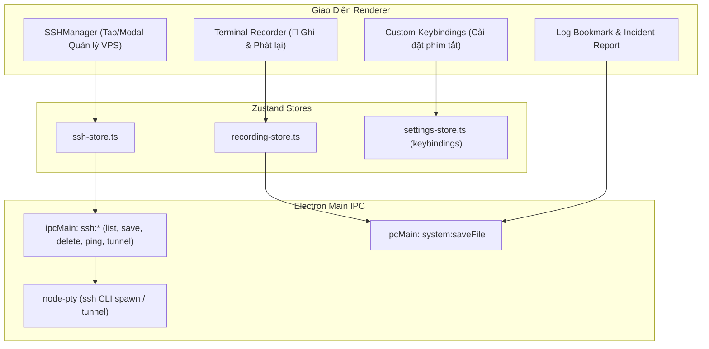

# Kế Hoạch Triển Khai Giai Đoạn 3 (Phase 3 Implementation Plan)

## 📌 Mục Tiêu Giai Đoạn 3
Triển khai toàn bộ 3 nhóm tính năng lớn theo lộ trình [TODO.md](file:///f:/Workspace/App/CLIM/docs/TODO.md):
1. **Trình Quản Lý Máy Chủ Từ Xa (Remote SSH Manager)**: Lưu trữ VPS/Server, kết nối 1-click vào terminal, hỗ trợ Private Key & Port Forwarding Tunnels.
2. **Ghi Lại Phiên Terminal & Đánh Dấu Log (Session Recording & Log Bookmarks/Incident Report)**: Ghi lại phiên làm việc terminal (hỗ trợ xuất .cast/HTML/txt), đánh dấu ⭐ log quan trọng và xuất Báo Cáo Sự Cố 1-click (hỗ trợ gửi Discord/Telegram).
3. **Tùy Chỉnh Phím Tắt Toàn Cục (Custom Keybindings)**: Cho phép ghi nhận và cấu hình lại toàn bộ phím tắt trong ứng dụng kèm phát hiện xung đột.

---

## 🏗️ Chi Tiết Thiết Kế Kỹ Thuật

---

## 📂 Danh Sách File Cần Tạo Mới & Chỉnh Sửa

### 1. Types & IPC Backend
- `[MODIFY]` [`src/shared/types.ts`](file:///f:/Workspace/App/CLIM/src/shared/types.ts):
  - Bổ sung `SSHHost`, `SSHTunnel`, `TerminalRecording`, `LogBookmark`, `IncidentReport`, `KeybindingMap`.
- `[NEW]` [`src/main/services/ssh-service.ts`](file:///f:/Workspace/App/CLIM/src/main/services/ssh-service.ts):
  - Xử lý lưu trữ mã hóa danh sách SSH Hosts, ping kiểm tra kết nối port, tạo lệnh ssh kết nối và thiết lập tunnel port forwarding.
- `[MODIFY]` [`src/main/ipc-handlers.ts`](file:///f:/Workspace/App/CLIM/src/main/ipc-handlers.ts):
  - Đăng ký các IPC handler cho `ssh:list`, `ssh:save`, `ssh:delete`, `ssh:testConnection`.
- `[MODIFY]` [`src/preload/index.ts`](file:///f:/Workspace/App/CLIM/src/preload/index.ts):
  - Phơi bày API `window.api.ssh` cho Renderer.

### 2. Quản Lý Máy Chủ SSH (Remote SSH Manager)
- `[NEW]` [`src/renderer/stores/ssh-store.ts`](file:///f:/Workspace/App/CLIM/src/renderer/stores/ssh-store.ts):
  - Quản lý danh sách Server, kết nối nhanh, lọc theo nhóm/tag.
- `[NEW]` [`src/renderer/components/ssh/SSHManager.tsx`](file:///f:/Workspace/App/CLIM/src/renderer/components/ssh/SSHManager.tsx):
  - Giao diện danh sách máy chủ dạng thẻ / bảng, kiểm tra trạng thái Online/Offline, nút kết nối 1-click vào terminal mới.
- `[NEW]` [`src/renderer/components/ssh/SSHHostModal.tsx`](file:///f:/Workspace/App/CLIM/src/renderer/components/ssh/SSHHostModal.tsx):
  - Form thêm/sửa Server: IP/Host, Port (22), Username, Chọn Private Key file hoặc Password, Cấu hình Port Forwarding Tunnels.

### 3. Ghi Lại Lịch Sử Terminal & Đánh Dấu Log (Session Recording & Incident Report)
- `[NEW]` [`src/renderer/stores/recording-store.ts`](file:///f:/Workspace/App/CLIM/src/renderer/stores/recording-store.ts):
  - Lưu trữ trạng thái recording realtime, bookmarks, và lịch sử bản ghi.
- `[NEW]` [`src/renderer/components/terminal/TerminalRecorderButton.tsx`](file:///f:/Workspace/App/CLIM/src/renderer/components/terminal/TerminalRecorderButton.tsx):
  - Nút bật/tắt ghi hình `🔴 REC` trên toolbar terminal, hiển thị thời gian ghi trực tiếp.
- `[NEW]` [`src/renderer/components/terminal/IncidentReportModal.tsx`](file:///f:/Workspace/App/CLIM/src/renderer/components/terminal/IncidentReportModal.tsx):
  - Cửa sổ xuất Báo Cáo Sự Cố chuyên nghiệp: trích xuất log lỗi, thời gian, chẩn đoán AI, hỗ trợ copy Markdown hoặc gửi webhook Telegram/Discord 1-click.
- `[NEW]` [`src/renderer/lib/asciinema-exporter.ts`](file:///f:/Workspace/App/CLIM/src/renderer/lib/asciinema-exporter.ts):
  - Bộ xuất file `.cast` tiêu chuẩn asciinema và file `.html` standalone player có thể mở xem trực tiếp trên mọi trình duyệt.

### 4. Tùy Chỉnh Phím Tắt Toàn Cục (Custom Keybindings)
- `[MODIFY]` [`src/renderer/stores/settings-store.ts`](file:///f:/Workspace/App/CLIM/src/renderer/stores/settings-store.ts):
  - Bổ sung cấu hình `keybindings: KeybindingMap` với giá trị mặc định cho toàn bộ phím tắt.
- `[NEW]` [`src/renderer/components/settings/KeybindingsSettingsTab.tsx`](file:///f:/Workspace/App/CLIM/src/renderer/components/settings/KeybindingsSettingsTab.tsx):
  - Giao diện gán phím tương tác: bấm vào ô phím tắt -> bấm tổ hợp phím mới trên bàn phím -> tự động nhận diện phím và cảnh báo trùng lặp.
- `[MODIFY]` [`src/renderer/components/settings/SettingsModal.tsx`](file:///f:/Workspace/App/CLIM/src/renderer/components/settings/SettingsModal.tsx):
  - Thêm tab "⌨️ Phím Tắt" vào thanh điều hướng Cài đặt.
- `[MODIFY]` [`src/renderer/hooks/useKeyboardShortcuts.ts`](file:///f:/Workspace/App/CLIM/src/renderer/hooks/useKeyboardShortcuts.ts):
  - Lắng nghe phím tắt động theo cấu hình người dùng thay vì hardcode.

### 5. Tích Hợp Vào Giao Diện Chính
- `[MODIFY]` [`src/renderer/components/layout/MainContent.tsx`](file:///f:/Workspace/App/CLIM/src/renderer/components/layout/MainContent.tsx):
  - Thêm tab điều hướng `Máy chủ SSH (Ctrl+7)` trên thanh Menu Header và định tuyến hiển thị `SSHManager`.
- `[MODIFY]` [`src/renderer/components/terminal/TerminalTabs.tsx`](file:///f:/Workspace/App/CLIM/src/renderer/components/terminal/TerminalTabs.tsx) & [`TerminalPanel.tsx`](file:///f:/Workspace/App/CLIM/src/renderer/components/terminal/TerminalPanel.tsx):
  - Gắn nút `🔴 REC` và nút `⭐ Đánh dấu / Báo cáo sự cố` vào thanh công cụ terminal.

---

## 🧪 Kế Hoạch Kiểm Thử (Verification Plan)
1. **Kiểm tra biên dịch & Unit Test**:
   - `npm run typecheck`: Đảm bảo 0 lỗi TypeScript.
   - `npx vitest run`: Viết test mới cho `ssh-store.test.ts`, `recording-store.test.ts` và đảm bảo toàn bộ test cũ tiếp tục pass 100%.
2. **Kiểm tra thủ công từng tính năng**:
   - **SSH Manager**: Thêm server mẫu, kiểm tra kết nối, kiểm tra khởi chạy terminal với lệnh SSH 1-click.
   - **Terminal Recording**: Bật `🔴 REC`, gõ lệnh trong terminal, dừng ghi và xuất file `.cast` / `.html` / `.txt`.
   - **Incident Report**: Đánh dấu đoạn log lỗi, mở modal báo cáo sự cố, copy Markdown hoặc gửi webhook.
   - **Custom Keybindings**: Đổi phím tắt `Ctrl+K` thành `Ctrl+P`, kiểm tra spotlight mở đúng với `Ctrl+P`.
3. **Cập nhật tài liệu**:
   - Cập nhật file [`TODO.md`](file:///f:/Workspace/App/CLIM/docs/TODO.md) đánh dấu hoàn thành Giai đoạn 3 và ghi chép Change Log.
