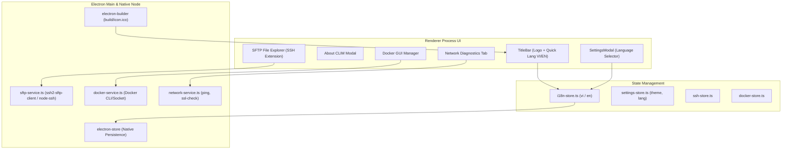

# Kế Hoạch Triển Khai Giai Đoạn 4 (Phase 4 Implementation Plan)
## Đa Ngôn Ngữ (English & Tiếng Việt), Thiết Kế Logo Thương Hiệu & Mở Rộng Hệ Sinh Thái CLIM

Tài liệu này xác định chi tiết kế hoạch kỹ thuật cho **Giai đoạn 4 (Phase 4)** của ứng dụng **CLIM**.

---

## 🎯 Mục Tiêu Chính Trong Phase 4

1. **Thiết Kế Logo & Bộ Nhận Diện Thương Hiệu (App Branding & Logo Design)**:
   - Thiết kế Vector Logo SVG độc quyền mang phong cách Cyberpunk / Modern Minimalist kết hợp giữa ký tự Terminal Prompt `>_`, tia chớp hiệu năng cao và màu sắc Neon Gradient (`Emerald` & `Cyan`).
   - Cung cấp đầy đủ các định dạng xuất bản: `build/icon.ico` (cho file cài đặt Windows `.exe`), `build/icon.png` (512x512), và `logo.svg` trên thanh TitleBar.
   - Thêm hộp thoại **About CLIM** hiển thị phiên bản, bản quyền, thông tin hệ thống và liên kết cộng đồng.

2. **Hệ Thống Đa Ngôn Ngữ Song Ngữ (Localization - i18n)**:
   - Hỗ trợ chuyển đổi tức thì giữa **Tiếng Việt 🇻🇳** và **English 🇬🇧** mượt mà, không cần khởi động lại ứng dụng.
   - Xây dựng `i18n-store.ts` linh hoạt, tự động lưu lựa chọn ngôn ngữ vào `electron-store`.
   - Dịch thuật toàn bộ các phân hệ: Terminal, Commands, Sequences, Profiles, Scheduler, Monitor, SSH, Settings, AI Copilot, Guide, Modals.
   - Bổ sung nút chuyển đổi ngôn ngữ nhanh trên **TitleBar** và trong **SettingsModal**.

3. **Trình Quản Lý Tệp Máy Chủ Từ Xa (SFTP Remote File Explorer)**:
   - Tích hợp cây thư mục tệp đồ họa bên cạnh cửa sổ terminal SSH.
   - Cho phép tải lên (Upload - kéo thả), tải xuống (Download), tạo tệp/thư mục, đổi tên và mở chỉnh sửa tệp trực tiếp trên máy chủ VPS.

4. **Trình Quản Lý Docker Trực Quan (Docker Containers GUI Manager)**:
   - Tự động nhận diện Docker Daemon.
   - Hiển thị danh sách Containers (Bật/Tắt/Khởi động lại/Xem log realtime 1-click).

5. **Tự Động Phục Hồi Phiên Làm Việc (Session Restore & Smart Auto-Save)**:
   - Ghi nhớ các tab terminal, thư mục đang mở (CWD) và chế độ chia màn hình (Split Pane) để tự động khôi phục lại nguyên trạng khi mở lại app.

6. **Bộ Công Cụ Chẩn Đoán Mạng Nâng Cao (Network Diagnostics Suite)**:
   - Biểu đồ đo độ trễ Ping thời gian thực (Real-time Latency Graph).
   - Kiểm tra Endpoint HTTP & hạn chứng chỉ SSL trực tiếp trong tab Giám sát.

---

## 🏗️ Kiến Trúc Thiết Kế Kỹ Thuật (Architecture)

---

## 📂 Danh Sách File Cần Triển Khai

### 1. Logo & Nhận Diện Thương Hiệu
- `[NEW]` [`src/renderer/assets/logo.svg`](file:///f:/Workspace/App/CLIM/src/renderer/assets/logo.svg): Vector Logo chính thức của CLIM.
- `[NEW]` [`build/icon.ico`](file:///f:/Workspace/App/CLIM/build/icon.ico): Icon ứng dụng định dạng Windows ICO đa độ phân giải (16x16, 32x32, 48x48, 256x256).
- `[NEW]` [`build/icon.png`](file:///f:/Workspace/App/CLIM/build/icon.png): Icon PNG độ phân giải cao 512x512.
- `[NEW]` [`src/renderer/components/about/AboutModal.tsx`](file:///f:/Workspace/App/CLIM/src/renderer/components/about/AboutModal.tsx): Modal giới thiệu phần mềm CLIM.
- `[MODIFY]` [`src/renderer/components/layout/TitleBar.tsx`](file:///f:/Workspace/App/CLIM/src/renderer/components/layout/TitleBar.tsx): Tích hợp Logo và nút mở About Modal.

### 2. Hệ Thống Đa Ngôn Ngữ (i18n)
- `[NEW]` [`src/renderer/locales/vi.ts`](file:///f:/Workspace/App/CLIM/src/renderer/locales/vi.ts): Từ điển tiếng Việt toàn bộ ứng dụng.
- `[NEW]` [`src/renderer/locales/en.ts`](file:///f:/Workspace/App/CLIM/src/renderer/locales/en.ts): Từ điển tiếng Anh toàn bộ ứng dụng.
- `[NEW]` [`src/renderer/stores/i18n-store.ts`](file:///f:/Workspace/App/CLIM/src/renderer/stores/i18n-store.ts): Quản lý chuyển đổi ngôn ngữ, hàm `t()`, lưu vào native store.
- `[MODIFY]` [`src/renderer/components/layout/TitleBar.tsx`](file:///f:/Workspace/App/CLIM/src/renderer/components/layout/TitleBar.tsx): Bổ sung nút chuyển nhanh `🇻🇳 VI` / `🇬🇧 EN`.
- `[MODIFY]` [`src/renderer/components/settings/SettingsModal.tsx`](file:///f:/Workspace/App/CLIM/src/renderer/components/settings/SettingsModal.tsx): Tùy chọn ngôn ngữ trong mục Cài đặt chung.

### 3. Remote SFTP & Docker GUI
- `[NEW]` [`src/renderer/components/ssh/SFTPExplorerModal.tsx`](file:///f:/Workspace/App/CLIM/src/renderer/components/ssh/SFTPExplorerModal.tsx): Trình quản lý cây thư mục và file trên VPS.
- `[NEW]` [`src/renderer/components/docker/DockerManager.tsx`](file:///f:/Workspace/App/CLIM/src/renderer/components/docker/DockerManager.tsx): Giao diện quản lý Container Docker 1-click.
- `[MODIFY]` [`src/main/ipc-handlers.ts`](file:///f:/Workspace/App/CLIM/src/main/ipc-handlers.ts): Bổ sung các IPC handler cho Docker & SFTP.

---

## 🧪 Kế Hoạch Kiểm Thử (Verification Plan)

### Automated Tests
- `npm run typecheck`: Kiểm tra tính toàn vẹn của TypeScript cho toàn bộ các file từ điển và store mới.
- `npm run test:run`: Chạy bộ unit test đảm bảo không hồi quy logic cũ.

### Manual Verification
1. **Kiểm tra Logo & Build**:
   - Chạy ứng dụng và kiểm tra Logo hiển thị sắc nét trên TitleBar, Taskbar Windows và Icon tệp cài đặt.
2. **Kiểm tra Chuyển Đổi Ngôn Ngữ**:
   - Bấm nút `🇬🇧 EN` trên TitleBar ➔ Toàn bộ giao diện (Menu, Nút bấm, Bảng, Hướng dẫn, Cài đặt) chuyển sang tiếng Anh tức thì.
   - Bấm nút `🇻🇳 VI` ➔ Quay lại tiếng Việt mượt mà.
   - Khởi động lại app ➔ Kiểm tra ngôn ngữ vừa chọn được giữ nguyên vẹn.
3. **Kiểm tra Webhook & Báo cáo Thực Thi**:
   - Gửi báo cáo kiểm tra trên Discord/Telegram để đảm bảo định dạng hiển thị chuẩn xác.
