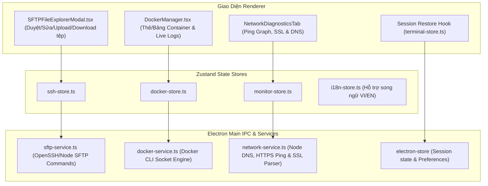

# Kế Hoạch Triển Khai Mở Rộng Hệ Sinh Thái CLIM (Phase 4.2 Ecosystem)

Tài liệu này xác định thiết kế chi tiết và các bước triển khai cho 4 hệ sinh thái công cụ lớn tiếp theo trong **Phase 4**:

---

## 🎯 4 Phân Hệ Mở Rộng Cốt Lõi

1. **Trình Quản Lý Tệp Từ Xa (SFTP Remote File Explorer)**
   - Tích hợp trực tiếp vào thẻ máy chủ trong `SSHManager.tsx` với nút **"📁 Quản Lý Tệp (SFTP)"**.
   - Giao diện duyệt cây thư mục & danh sách tệp trực quan (icon định dạng tệp, kích thước, quyền chmod, ngày sửa đổi, thanh breadcrumb đường dẫn).
   - Thao tác tệp 1-click: Xem & Chỉnh sửa trực tiếp trên Modal Code Editor, Tải lên (Upload kéo thả / chọn file), Tải xuống (Download), Tạo thư mục mới, Đổi tên & Xóa tệp từ xa.

2. **Bảng Điều Khiển Docker Containers Trực Quan (Docker GUI Manager)**
   - Tự động nhận diện Docker Engine trên máy cục bộ hoặc qua SSH.
   - Thống kê thời gian thực: Tổng số Container, Đang chạy (🟢 Running), Đã dừng (⏹️ Exited), Mức chiếm dụng RAM / CPU.
   - Bảng điều khiển & Card view:
     - 1-click: **Bật (Start)**, **Dừng (Stop)**, **Khởi động lại (Restart)**, **Xóa (Remove)**.
     - **Xem Logs thời gian thực (Live Logs Viewer)** với bộ lọc và tìm kiếm.
     - **Mở Terminal tương tác vào Container 1-click** (`docker exec -it <container> sh/bash`) mở ngay trong tab Terminal của CLIM.

3. **Bộ Công Cụ Chẩn Đoán Mạng Chuyên Sâu (Network Diagnostics Suite)**
   - Tích hợp tab thứ 3 vào `ResourceMonitor.tsx` (`Hệ Thống` | `Cổng Mạng` | `Chẩn Đoán Mạng`):
     - **Biểu đồ Ping Thời Gian Thực (Ping Latency Graph)**: Đo độ trễ ms đến máy chủ (Google 8.8.8.8, Cloudflare 1.1.1.1, Gateway hoặc IP tùy chỉnh) vẽ biểu đồ SVG động.
     - **Kiểm Tra Điểm Cuối HTTP & Chứng Chỉ SSL (HTTP & SSL Health Check)**: Kiểm tra mã phản hồi HTTP 200/404/500, thời gian phản hồi (ms), giao thức TLS và số ngày còn lại của chứng chỉ SSL (cảnh báo nếu sắp hết hạn).
     - **Tra Cứu Bản Ghi Tên Miền (DNS Multi-Record Lookup)**: Tra cứu nhanh các bản ghi A, AAAA, CNAME, MX, TXT của tên miền.

4. **Tự Động Phục Hồi Phiên Làm Việc (Smart Session Restore & Auto-Save)**
   - Lưu trữ trạng thái phiên làm việc (các tab terminal đang mở, shell tương ứng, thư mục làm việc CWD, bố cục chia màn hình split layout) vào `electron-store`.
   - Tự động khôi phục khi mở lại app nếu bật tùy chọn trong Cài đặt.

---

## 🏗️ Sơ Đồ Kiến Trúc (Architecture Diagram)

---

## 📂 Danh Sách File Cần Tạo & Chỉnh Sửa

### 1. Types & IPC Backend
- `[MODIFY]` [`src/shared/types.ts`](file:///f:/Workspace/App/CLIM/src/shared/types.ts):
  - Khai báo kiểu `DockerContainer`, `DockerStats`, `SFTPItem`, `PingDataPoint`, `SSLCheckResult`, `DNSLookupResult`.
- `[NEW]` [`src/main/services/docker-service.ts`](file:///f:/Workspace/App/CLIM/src/main/services/docker-service.ts):
  - Service gọi Docker CLI: `docker ps -a`, `docker start/stop/restart/rm`, `docker logs`, `docker stats`.
- `[NEW]` [`src/main/services/sftp-service.ts`](file:///f:/Workspace/App/CLIM/src/main/services/sftp-service.ts):
  - Service duyệt tệp, tải lên/tải xuống, đọc và ghi tệp từ xa qua SSH.
- `[NEW]` [`src/main/services/network-service.ts`](file:///f:/Workspace/App/CLIM/src/main/services/network-service.ts):
  - Service đo Ping ICMP, kiểm tra HTTP status & SSL cert expiry, phân giải DNS records.
- `[MODIFY]` [`src/main/ipc-handlers.ts`](file:///f:/Workspace/App/CLIM/src/main/ipc-handlers.ts):
  - Đăng ký các handler: `docker:*`, `sftp:*`, `network:*`.
- `[MODIFY]` [`src/preload/index.ts`](file:///f:/Workspace/App/CLIM/src/preload/index.ts):
  - Phơi bày các API mới trong `window.api`.

### 2. Frontend Components & Stores
- `[NEW]` [`src/renderer/stores/docker-store.ts`](file:///f:/Workspace/App/CLIM/src/renderer/stores/docker-store.ts):
  - Quản lý danh sách container, auto polling, trạng thái start/stop.
- `[NEW]` [`src/renderer/components/docker/DockerManager.tsx`](file:///f:/Workspace/App/CLIM/src/renderer/components/docker/DockerManager.tsx):
  - Giao diện quản lý Container, xem log và mở shell terminal.
- `[NEW]` [`src/renderer/components/ssh/SFTPFileExplorerModal.tsx`](file:///f:/Workspace/App/CLIM/src/renderer/components/ssh/SFTPFileExplorerModal.tsx):
  - Modal duyệt cây thư mục tệp VPS, tải tệp, sửa tệp trực tiếp.
- `[NEW]` [`src/renderer/components/monitor/NetworkDiagnosticsView.tsx`](file:///f:/Workspace/App/CLIM/src/renderer/components/monitor/NetworkDiagnosticsView.tsx):
  - Biểu đồ Ping thời gian thực, SSL checker, DNS lookup.
- `[MODIFY]` [`src/renderer/components/ssh/SSHManager.tsx`](file:///f:/Workspace/App/CLIM/src/renderer/components/ssh/SSHManager.tsx):
  - Gắn nút mở `SFTPFileExplorerModal` trên từng Server.
- `[MODIFY]` [`src/renderer/components/monitor/ResourceMonitor.tsx`](file:///f:/Workspace/App/CLIM/src/renderer/components/monitor/ResourceMonitor.tsx):
  - Tích hợp sub-tab `network` để mở `NetworkDiagnosticsView`.
- `[MODIFY]` [`src/renderer/components/layout/MainContent.tsx`](file:///f:/Workspace/App/CLIM/src/renderer/components/layout/MainContent.tsx):
  - Bổ sung tab điều hướng Docker và tích hợp chuyển tab.
- `[MODIFY]` [`src/renderer/locales/vi.ts`](file:///f:/Workspace/App/CLIM/src/renderer/locales/vi.ts) & [`src/renderer/locales/en.ts`](file:///f:/Workspace/App/CLIM/src/renderer/locales/en.ts):
  - Bổ sung đầy đủ từ điển song ngữ cho Docker, SFTP và Network Diagnostics.

---

## 🧪 Kế Hoạch Kiểm Thử (Verification Plan)

### Automated Tests
- `npm run typecheck`: Đảm bảo 0 lỗi TypeScript trên cả Node Backend và Renderer.
- `npm run test:run`: Thêm test cho `docker-store.test.ts` và chạy toàn bộ unit tests hiện có.

### Manual Verification
1. **Docker Manager**:
   - Mở tab Docker ➔ Kiểm tra hiển thị danh sách containers hoặc thông báo nếu Docker chưa bật.
   - Thử Start / Stop / Restart container hoặc xem Logs.
   - Bấm "Mở Terminal Shell" ➔ Terminal mở tab mới và kết nối vào container.
2. **SFTP File Explorer**:
   - Mở modal SFTP trên máy chủ SSH ➔ Kiểm tra hiển thị danh sách thư mục `/root` hoặc `/home`.
   - Mở xem nội dung tệp văn bản.
3. **Network Diagnostics**:
   - Nhập `8.8.8.8` hoặc `google.com` ➔ Kiểm tra biểu đồ Ping nhảy số liệu thời gian thực.
   - Nhập URL `https://github.com` ➔ Kiểm tra hạn SSL và mã HTTP 200.
   - Tra cứu DNS `google.com` ➔ Kiểm tra danh sách IP A / AAAA / MX.
4. **Session Restore**:
   - Mở 2 tab terminal ➔ Khởi động lại ứng dụng ➔ Kiểm tra các tab được tự động khôi phục.
